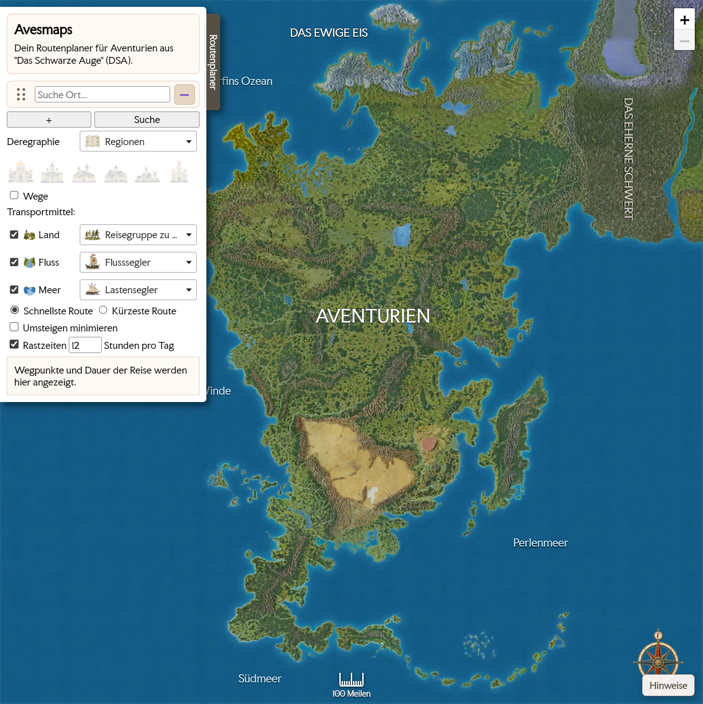

# Avesmaps

Avesmaps ist ein offener, nicht-kommerzieller Routenplaner fuer Aventurien aus
dem Rollenspiel "Das Schwarze Auge". Die Anwendung zeigt eine kachelbasierte
Karte, Orte, Wege und optionale Regionsgrenzen an und berechnet Reiserouten
direkt im Browser.



Die aktuell erreichbare Version laeuft unter [https://valentin-schwind.github.io/avesmaps/](https://valentin-schwind.github.io/avesmaps/).

## Was das Projekt kann

- Orte, Wege und Grenzen auf einer lokal gehosteten Karte darstellen
- eine politische Karte mit den Grenzen der Reiche anzeigen
- Routen zwischen mehreren Wegpunkten berechnen
- zwischen kuerzester und schnellster Route unterscheiden
- Land-, Fluss- und Seewege mit unterschiedlichen Transportmitteln einbeziehen
- Umstiege auf Wunsch mit einer Strafgewichtung minimieren
- die aktuelle URL kopieren, um Routen und Einstellungen direkt zu teilen

## Wie die Routen berechnet werden

Die Routenberechnung basiert auf dem **Dijkstra-Algorithmus**. Im Code wird dafuer ein gewichteter Graph aus den GeoJSON-Wegen aufgebaut:

- Orte werden als Knoten verwendet
- Wege zwischen zwei Orten werden als Kanten verwendet
- jede Kante erhaelt Gewichte fuer Distanz und Reisezeit
- optional wird eine zusaetzliche Umstiegsstrafe beruecksichtigt, wenn das Transportmittel wechselt

Zur Beschleunigung verwendet die Implementierung eine **PriorityQueue auf Basis eines Min-Heaps**. Dadurch werden immer zuerst die aktuell guenstigsten Kandidaten verarbeitet. Je nach Einstellung optimiert der Algorithmus auf Distanz oder auf Reisezeit.

## Technischer Aufbau

Die Anwendung ist bewusst einfach gehalten:

- `index.html` enthaelt den groessten Teil der Logik fuer Karte, Datenverarbeitung und Routenplanung
- `tiles/` enthaelt die Kartenkacheln
- `api/` enthaelt den optionalen PHP-Endpoint fuer Ortsmeldungen, Beispiel-Konfiguration und SQL-Schemata
- `css/`, `js/` und `fonts/` enthalten alle benoetigten Assets lokal im Repository

Die Karten- und Routenlogik selbst bleibt komplett im Browser:

- kein externer Tile-Server
- keine CDN-Einbindung
- kein Build-Schritt

Fuer Ortsmeldungen kann Avesmaps optional ein kleines PHP-/SQL-Backend nutzen. Ohne `api/` laeuft die Anwendung weiterhin als rein statische Karte und Routenplanung.

## Lokale Nutzung

Da die Anwendung GeoJSON per XMLHttpRequest laedt, sollte sie nicht direkt per `file://` geoeffnet werden. Stattdessen sollte ein kleiner lokaler Webserver verwendet werden.

Beispiel mit Python im Projektverzeichnis:

```bash
python -m http.server 8000
```

Danach ist die Anwendung unter [http://localhost:8000](http://localhost:8000) erreichbar.

Wenn auch das Ortsmelde-Formular lokal getestet werden soll, ist ein PHP-faehiger Server sinnvoll, zum Beispiel:

```bash
php -S localhost:8000
```

Dann koennen die statischen Dateien und `api/report-location.php` direkt ueber denselben Host laufen.

## Deployment

Fuer die reine Karte reicht es, den kompletten Projektordner auf einen beliebigen statischen Webserver zu legen. Es ist kein Build-Schritt notwendig.

Wenn das Ortsmelde-Formular aktiv sein soll, braucht die API einen PHP-faehigen Server und eine SQL-Datenbank. Zwei typische Varianten:

- gesamtes Projekt auf einem PHP-Webserver hosten, sodass `api/report-location.php` relativ erreichbar ist
- Frontend statisch hosten und `window.AVESMAPS_LOCATION_REPORT_ENDPOINT` auf eine absolute API-URL setzen

Wichtig: GitHub Pages kann den PHP-Teil nicht selbst ausfuehren. Ohne separate API bleibt das Meldeformular dort deshalb deaktiviert.

## URL-Sharing des Routenplaners

Der Zustand des Routenplaners kann ueber Query-Parameter in der URL gespeichert und geteilt werden. Dazu gehoeren insbesondere:

- die Wegpunkte
- die Auswahl schnellste oder kuerzeste Route
- die Anzeigeoptionen fuer Orte, Wege und Grenzen
- die aktivierten Transportwege
- die gewaehlten Transportmittel
- Rastzeiten
- die Option zum Minimieren von Umstiegen

Dadurch kann eine fertig konfigurierte Route einfach geteilt werden, indem die URL aus dem Browser kopiert und weitergegeben wird.

## Ortsmeldungen per PHP und SQL

Die Datei `api/report-location.php` nimmt neue Ortsmeldungen als JSON entgegen und speichert sie in der Tabelle `location_reports`.

### Einmaliges Setup

1. Passendes SQL-Schema aus `api/schema.mysql.sql` oder `api/schema.pgsql.sql` ausfuehren.
2. `api/config.example.php` nach `api/config.local.php` kopieren.
3. Dort Datenbank-Zugang und erlaubte Frontend-Origins eintragen.
4. Den Ordner `api/` auf einem PHP-faehigen Server ausliefern.

Alternativ kann die API ueber Umgebungsvariablen konfiguriert werden:

- `AVESMAPS_DB_DRIVER`
- `AVESMAPS_DB_HOST`
- `AVESMAPS_DB_PORT`
- `AVESMAPS_DB_NAME`
- `AVESMAPS_DB_CHARSET`
- `AVESMAPS_DB_USER`
- `AVESMAPS_DB_PASSWORD`
- `AVESMAPS_ALLOWED_ORIGINS`

Wenn Frontend und API nicht auf derselben Origin laufen, muss die Frontend-Seite den Endpoint explizit setzen, zum Beispiel:

```html
<script>
	window.AVESMAPS_LOCATION_REPORT_ENDPOINT = "https://example.org/avesmaps/api/report-location.php";
</script>
```

## Hinweise zur Datenpflege

- Die Kartenquelle ist aktuell in den Karten- und Datenworkflows des Repositories verankert.
- Aenderungen an der Kartendatenbasis muessen immer mit dem passenden Import- oder Erzeugungsschritt zusammen gedacht werden.
- Der aktualisierte Stand kann danach direkt ueber den statischen Webserver ausgeliefert werden.

## Rechtliches und Quellen

Avesmaps ist ein Fanprojekt und verwendet DSA-bezogenes Material unter
Beruecksichtigung der Ulisses-Fanrichtlinien.

Wichtige Punkte fuer dieses Repository:

- keine pauschale Open-Source-Lizenz fuer DSA-bezogene Karten-, Bild- und
  Datenassets
- Fanprojekt-Logo statt offizieller Produktlogos
- keine Weitergabe des verwendeten Materials unter Creative-Commons- oder
  vergleichbaren Fremdlizenzen
- keine offizielle Verbindung zu Ulisses Spiele

Details, Quellen und Hinweise zur Rechte-Lage stehen in
[`NOTICE.md`](NOTICE.md).
