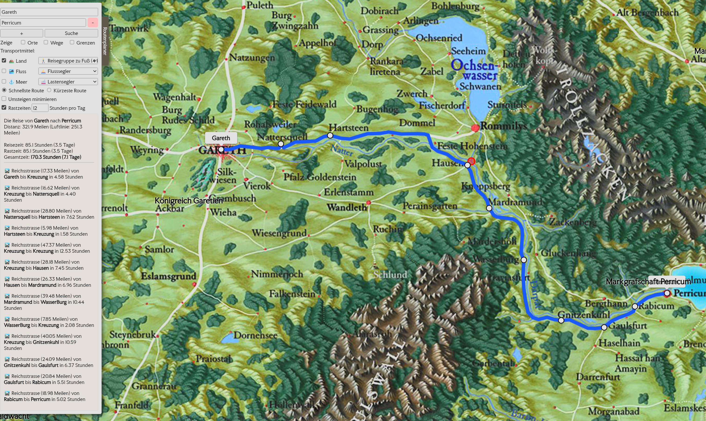

# Avesmaps

Avesmaps ist ein offener, nicht-kommerzieller Routenplaner fuer Aventurien aus
dem Rollenspiel "Das Schwarze Auge". Die Anwendung zeigt eine kachelbasierte
Karte, Orte, Wege und optionale Regionsgrenzen an und berechnet Reiserouten
direkt im Browser.



Die aktuell erreichbare Version laeuft unter [https://valentin-schwind.github.io/avesmaps/](https://valentin-schwind.github.io/avesmaps/).

## Was das Projekt kann

- Orte, Wege und Grenzen auf einer lokal gehosteten Karte darstellen
- eine politische Karte mit den Grenzen der Reiche anzeigen
- Routen zwischen mehreren Wegpunkten berechnen
- zwischen kuerzester und schnellster Route unterscheiden
- Land-, Fluss- und Seewege mit unterschiedlichen Transportmitteln einbeziehen
- Umstiege auf Wunsch mit einer Strafgewichtung minimieren
- die aktuelle URL kopieren, um Routen und Einstellungen direkt zu teilen

## Wie die Routen berechnet werden

Die Routenberechnung basiert auf dem **Dijkstra-Algorithmus**. Im Code wird dafuer ein gewichteter Graph aus den GeoJSON-Wegen aufgebaut:

- Orte werden als Knoten verwendet
- Wege zwischen zwei Orten werden als Kanten verwendet
- jede Kante erhaelt Gewichte fuer Distanz und Reisezeit
- optional wird eine zusaetzliche Umstiegsstrafe beruecksichtigt, wenn das Transportmittel wechselt

Zur Beschleunigung verwendet die Implementierung eine **PriorityQueue auf Basis eines Min-Heaps**. Dadurch werden immer zuerst die aktuell guenstigsten Kandidaten verarbeitet. Je nach Einstellung optimiert der Algorithmus auf Distanz oder auf Reisezeit.

## Technischer Aufbau

Die Anwendung ist bewusst einfach gehalten:

- `index.html` enthaelt den groessten Teil der Logik fuer Karte, Datenverarbeitung und Routenplanung
- `tiles/` enthaelt die Kartenkacheln
- `map/Aventurien_routes.geojson` enthaelt Orte und Wege fuer die Routenplanung
- `map/Aventurien_routes.svg` ist die editierbare SVG-Quelle fuer die Geodaten
- `map/svg_to_geojson.py` konvertiert die SVG in die GeoJSON-Datei
- `css/`, `js/` und `fonts/` enthalten alle benoetigten Assets lokal im Repository

Es gibt **keine Abhaengigkeit zu externen Diensten**:

- kein Backend
- keine API
- keine Datenbank
- kein externer Tile-Server
- keine CDN-Einbindung

Damit kann das Projekt auf **jedem normalen Webserver** betrieben werden, der statische Dateien ausliefert.

## Lokale Nutzung

Da die Anwendung GeoJSON per XMLHttpRequest laedt, sollte sie nicht direkt per `file://` geoeffnet werden. Stattdessen sollte ein kleiner lokaler Webserver verwendet werden.

Beispiel mit Python im Projektverzeichnis:

```bash
python -m http.server 8000
```

Danach ist die Anwendung unter [http://localhost:8000](http://localhost:8000) erreichbar.

## Deployment

Fuer den Betrieb reicht es, den kompletten Projektordner auf einen beliebigen Webserver zu legen. Es ist kein Build-Schritt und keine Serverlogik notwendig. Solange HTML-, CSS-, JS-, Bild-, Tile- und GeoJSON-Dateien statisch ausgeliefert werden, laeuft die Anwendung.

## URL-Sharing des Routenplaners

Der Zustand des Routenplaners kann ueber Query-Parameter in der URL gespeichert und geteilt werden. Dazu gehoeren insbesondere:

- die Wegpunkte
- die Auswahl schnellste oder kuerzeste Route
- die Anzeigeoptionen fuer Orte, Wege und Grenzen
- die aktivierten Transportwege
- die gewaehlten Transportmittel
- Rastzeiten
- die Option zum Minimieren von Umstiegen

Dadurch kann eine fertig konfigurierte Route einfach geteilt werden, indem die URL aus dem Browser kopiert und weitergegeben wird.

## SVG zu GeoJSON konvertieren

Die Datei [`map/svg_to_geojson.py`](map/svg_to_geojson.py) konvertiert die
SVG-Grundlage in die von der Anwendung verwendete GeoJSON-Datei.

### Erwartete Dateien

Die relevanten Dateien liegen im Ordner `map/`:

- Eingabe: `map/Aventurien_routes.svg`
- Ausgabe: `map/Aventurien_routes.geojson`

### Ausfuehrung

Im Projektverzeichnis:

```bash
python map/svg_to_geojson.py map/Aventurien_routes.svg --output map/Aventurien_routes.geojson
```

### Was das Skript macht

- es liest Orte, Kreuzungen, Wege und Regionen aus Inkscape-Layern
- es uebernimmt Layer- und Label-Informationen in GeoJSON-Metadaten
- es erhaelt Ortskategorien fuer die UI
- es schreibt daraus eine GeoJSON-`FeatureCollection`

### Abhaengigkeiten des Skripts

Das Skript verwendet ausschliesslich Python-Standardbibliothek.

Es werden fuer die Konvertierung **keine externen Services** benoetigt.

## Wiki-Aventurica-Links erzeugen

Die Datei `map/wiki_location_links.json` enthaelt die statische Lookup-Tabelle
fuer Ortslinks zu Wiki Aventurica. Die Anwendung laedt diese Datei lokal und
fragt Wiki Aventurica nicht zur Laufzeit im Browser ab.

Im Projektverzeichnis:

```bash
python map/build_wiki_location_links.py
```

Das Skript liest die Orte aus `map/Aventurien_routes.geojson`, gleicht sie ueber
die MediaWiki-API mit Wiki Aventurica ab und schreibt zusaetzlich
`map/wiki_location_links_report.json` mit Treffer- und Restlisten.

## Neue Ortsmeldungen aus Google Sheets importieren

Die Datei `map/import_reported_locations.py` liest neue Ortsmeldungen direkt aus
dem Google Sheet, fragt sie interaktiv durch und uebernimmt angenommene Eintraege
in die SVG-Quelle.

Der Ablauf des Skripts:

- es liest Zeilen mit `status = neu` aus dem Tabellenblatt `Ortsmeldungen`
- es zeigt jeden Eintrag einzeln mit Leaflet- und SVG-Koordinaten an
- bei Zustimmung fuegt es den Ort in `map/Aventurien_routes.svg` ein
- danach erzeugt es direkt `map/Aventurien_routes.geojson` neu
- anschliessend loescht es den angenommenen Eintrag aus dem Google Sheet
- bei Ablehnung fragt es zusaetzlich, ob der Sheet-Eintrag geloescht werden soll

### Voraussetzungen

Die Google-Abhaengigkeiten einmal installieren:

```bash
pip install -r map/requirements-location-import.txt
```

Danach eine Google-Credentials-Datei unter
`map/google-sheets-credentials.json` ablegen.

Moeglich sind:

- OAuth-Client fuer eine lokale Desktop-Anmeldung
- Service-Account-JSON, wenn das Sheet fuer diesen Account freigegeben wurde

### Ausfuehrung

Im Projektverzeichnis:

```bash
python map/import_reported_locations.py
```

Optional als Testlauf ohne Schreiben:

```bash
python map/import_reported_locations.py --dry-run
```

## Hinweise zur Datenpflege

- Die SVG ist die fachliche Quelle fuer Orte, Wege und Regionen.
- In `map/Aventurien_routes.svg` liegt die editierbare Karte.
- Die SVG wurde in **Inkscape** erstellt und sollte auch dort gepflegt werden.
- Nach Aenderungen an der SVG sollte die GeoJSON-Datei neu erzeugt werden.
- Danach kann der aktualisierte Stand direkt ueber den statischen Webserver
  ausgeliefert werden.

## Rechtliches und Quellen

Avesmaps ist ein Fanprojekt und verwendet DSA-bezogenes Material unter
Beruecksichtigung der Ulisses-Fanrichtlinien.

Wichtige Punkte fuer dieses Repository:

- keine pauschale Open-Source-Lizenz fuer DSA-bezogene Karten-, Bild- und
  Datenassets
- Fanprojekt-Logo statt offizieller Produktlogos
- keine Weitergabe des verwendeten Materials unter Creative-Commons- oder
  vergleichbaren Fremdlizenzen
- keine offizielle Verbindung zu Ulisses Spiele

Details, Quellen und Hinweise zur Rechte-Lage stehen in
[`NOTICE.md`](NOTICE.md).
